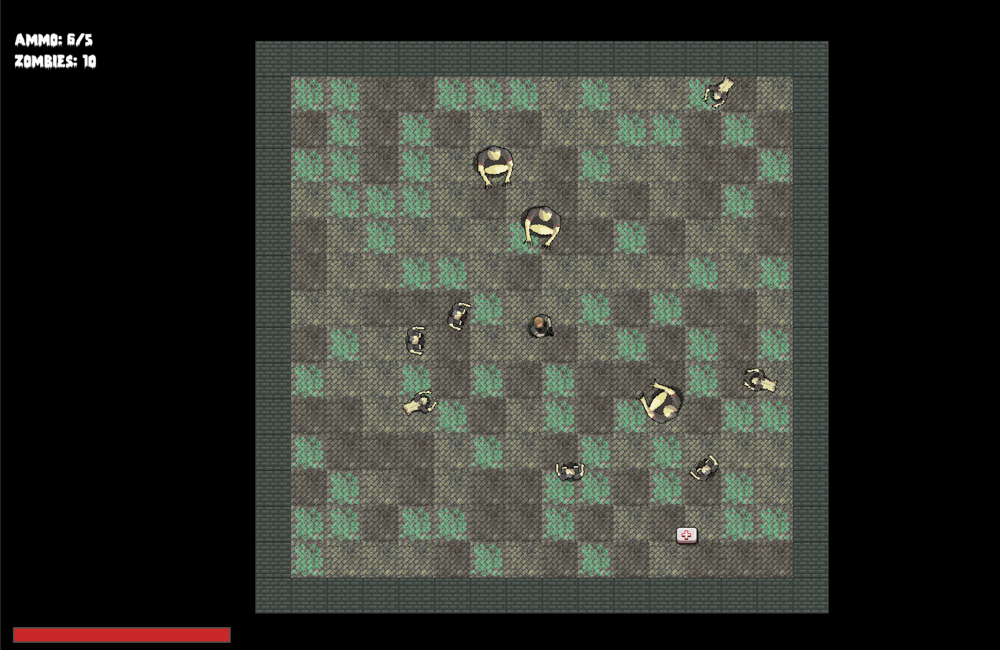

# SFML_Games

#1. 🧟 Zombie Arena (C++20 / SFML)

A top-down 2D zombie shooter built with **C++20** and **SFML**.  
Originally inspired by the *ZombieArena* tutorial, but fully redesigned with my own modular, event-driven architecture:  
separate subsystems (Input, Physics, Combat, Spawn, Render, Sound, HUD), an `EventBus` for decoupled communication, and a clear separation of world state (`World`) from game flow (`Game`).

📦 From the original tutorial I only reused **graphics and sound resources** — all gameplay code, systems, and architecture were implemented from scratch.

---

  

## 🚀 Features

- Player movement (WASD) with mouse aiming & shooting.
- Zombies that spawn in waves and chase the player.
- Pickups (health packs, ammo).
- Weapon system: bullets, shooting, reload, fire control.
- HUD showing health, ammo, score, and wave number.
- Tile-based arena background (walls + random floor tiles).
- Event-driven core (`EventBus`) to connect systems.

## 🎮 Controls

- **WASD** → Move  
- **Mouse (LMB)** → Shoot  
- **Enter** → Start / Pause / Confirm upgrade  
- **1–6** → Choose upgrade during Level Up  
- **Esc** → Exit 

## 🧩 Future Improvements
 
- Expanded weapon upgrades & powerups.  
- Difficulty settings and arena variations.  
- Gamepad support.
- VFX effects
- HUD improvements: visual style refinements, in-game menu integration. 

## ⚙️ Build Instructions

### Requirements
- [SFML 3.0.1+](https://www.sfml-dev.org/)
- CMake 3.16+
- A C++20-capable compiler (Clang, GCC, MSVC)
